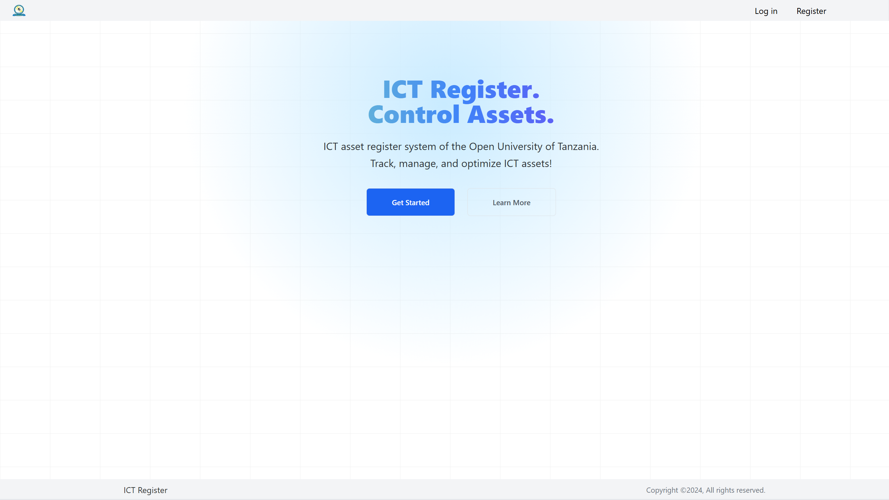
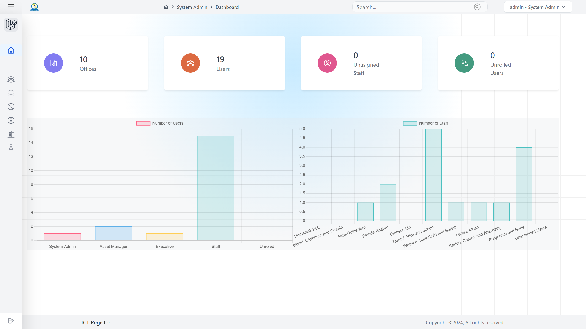
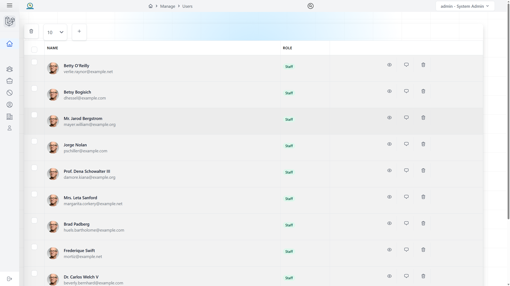
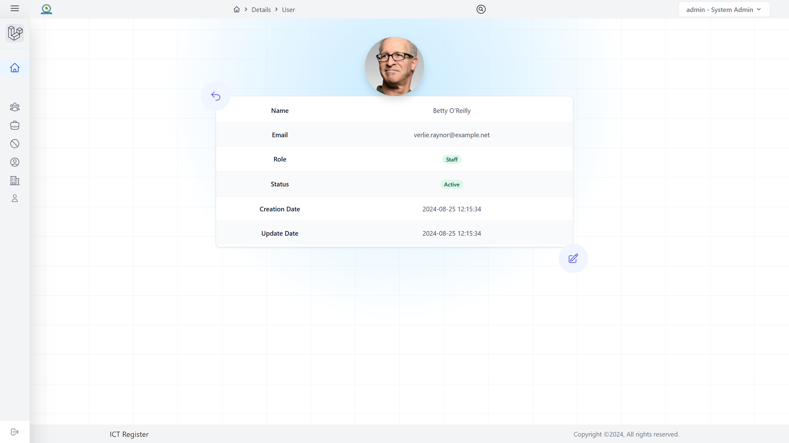
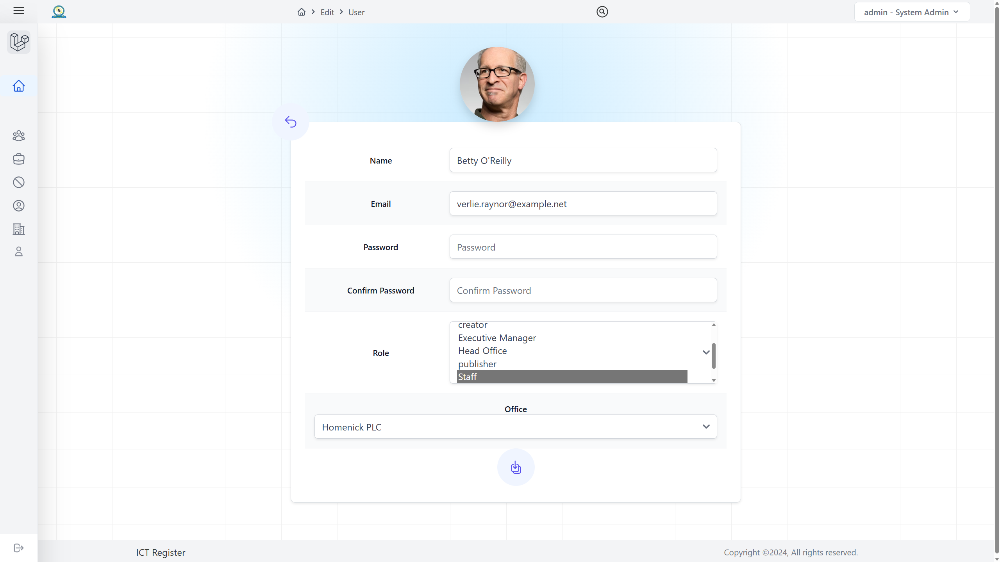

# ICT Asset Register System

<p align="center">
  
</p>

## Overview

The ICT Asset Register System is a comprehensive solution designed for The Open University of Tanzania (OUT) to track, manage, and optimize all ICT assets within the organization. This system aims to streamline asset management processes, fostering greater efficiency, cost-effectiveness, compliance, and security throughout the enterprise infrastructure.

## Features

- Asset Identification and Classification
- Centralized Asset Register
- Asset Management and Optimization
- Compliance Reporting
- Security Monitoring and Risk Mitigation
- Audit Trail and Compliance Documentation
- Maintenance Scheduling and Tracking
- Depreciation Calculation
- Asset Lifecycle Management
- Custom Report Generation

  
  
  
  


## User Roles

1. Staff
2. Asset Manager
3. System Admin
4. Executive Management

## Technologies Used

- Backend Framework: LARAVEL v11.14.0  plugin v1.0.5
- Database: PostgreSQL/MariaDB
- Frontend: Responsive Web Design (following WCAG guidelines)
- Server: Ubuntu 22.04
- Web Server: Apache

## Installation

1. Clone the repository

```bash
git clone https://git.out.ac.tz/isda/ict_register.git
```

2. Navigate to the project directory

```bash
cd ict-asset-register
```

3. Install dependencies

```bash
composer install
npm install
```

4. Copy the .env.example file to .env and configure your environment variables

```
cp .env.example .env
```

5. Generate application key

```bash
php artisan key:generate
```

6. Run migrations and seed the database

```bash
php artisan migrate --seed
```

7. Start the development server

```bash
php artisan serve
```

## Usage


## Contributing

## License


## Contact

For any queries regarding this project, please contact:

Infrastructure Unity (IU)
The Open University of Tanzania
Email: aziz.amor@student.out.ac.tz

## Acknowledgments

- This project is developed in alignment with OUT strategies on Enhancing internal and external communication.
- The system follows the "Guideline for development, acquisition, operation, and maintenance of e-Government Applications" of March 2020 provided by e-GA.

